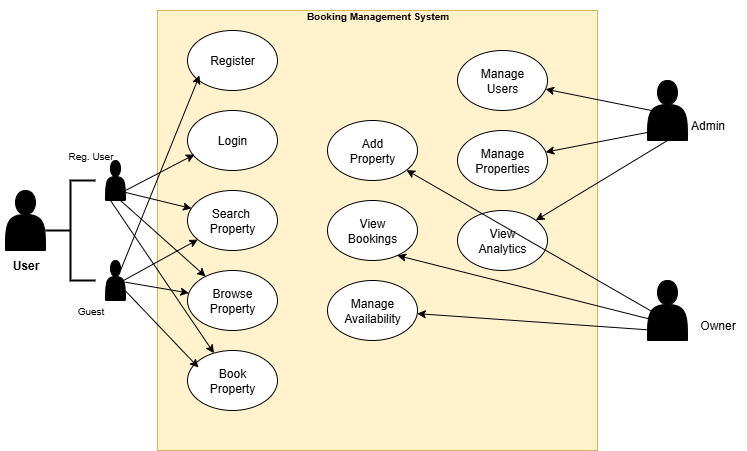

# Requirement Analysis in Software Development

Establishing a robust basis for software development through the systematic documentation, analysis, and organization of requirements.

# What is Requirement Analysis?
- Requirement analysis involves determining the intended functions of the software and the constraints governing its operation.
- Within the Software Development Life Cycle (SDLC), Requirement Analysis serves as a critical stage in which the project team systematically gathers, evaluates, and specifies software requirements. This process fosters a shared understanding among stakeholders regarding the system’s functionality and performance. Its importance lies in mitigating risks. Errors at this stage can result in significant costs and complications during later phases of development.

# Why is Requirement Analysis Important?
- **Prioritization of Features:** Determines which features should be developed first based on business value and user needs.
- **Clarity and Understanding:** Ensures stakeholders and developers share the same vision, reducing ambiguity.
- **Scope Definition:** Clearly defines project boundaries, preventing scope creep and uncontrolled changes.
- **Foundation for Design & Development:** Provides a structured blueprint that guides the system’s design and implementation.
- **Accurate Estimation:** Enables realistic cost, resource, and time estimates, minimizing risks of overruns.
- **Quality Assurance:** Ensures the final product meets requirements, improving reliability, usability, and customer satisfaction.

# Key Activities in Requirement Analysis.
### Requirement Gathering  
Collecting requirements from stakeholders using various methods:  
- **Interviews** → One-on-one discussions to capture detailed needs.  
- **Surveys/Questionnaires** → Reaching a wider audience efficiently.  
- **Workshops** → Collaborative sessions to refine requirements.  
- **Observation** → Studying end-users in their actual work environment.  
- **Document Analysis** → Reviewing existing systems, reports, and manuals.  

### Requirement Elicitation  
Techniques used to explore, discover, and refine requirements:  
- **Brainstorming** → Generating ideas collaboratively to uncover potential requirements.  
- **Focus Groups** → Engaging selected stakeholders in discussions to capture detailed insights.  
- **Prototyping** → Building simple prototypes to help stakeholders visualize the system and refine their needs.

### Requirement Documentation  
Recording requirements in clear, structured formats to guide design and development:  
- **Requirement Specification Document** → A detailed document listing all functional and non-functional requirements.  
- **User Stories** → Short, descriptive statements capturing system functionality from the user’s perspective.  
- **Use Cases** → Visual diagrams and descriptions showing interactions between users (actors) and the system.

### Requirement Analysis and Modeling  
Analyzing and representing requirements to ensure feasibility and clarity:  
- **Requirement Prioritization** → Ranking requirements based on importance and project impact.  
- **Feasibility Analysis** → Evaluating requirements in terms of technical, financial, and time constraints.  
- **Modeling** → Using diagrams (e.g., Data Flow Diagrams, Entity-Relationship Diagrams) to visualize and analyze requirements.  

### Requirement Validation  
Ensuring that requirements are correct, complete, and aligned with stakeholder expectations:  
- **Review and Approval** → Reviewing documented requirements with stakeholders to confirm accuracy and completeness.  
- **Acceptance Criteria** → Defining clear standards for each requirement to verify they meet expectations.  
- **Traceability** → Creating traceability matrices to ensure all requirements are covered during development and testing.  

# Types of Requirements
### Functional Requirements  
Functional requirements define the features and behaviors the system must provide to allow users to achieve their goals.  
They describe **what the system should do** under specific conditions.  
#### Examples for the Booking Management System:  
- **User Authentication** → Secure login and registration process for users.  
- **Property Search** → Ability to search for properties based on criteria such as location, price, and availability.  
- **Booking System** → Users can book properties, view booking details, and manage their bookings.  
- **User Registration** → New users can create an account with personal details and login credentials.  

### Non-Functional Requirements  
Non-functional requirements describe the quality attributes of the system.  
They define **how the system should perform** and often act as constraints across the design and development process.  
#### Examples for the Booking Management System:  
- **Maintainability** → The system should be easy to update, modify, and extend.  
- **Performance** → Pages should load within 3 seconds and the system must handle up to 2,000 concurrent users.  
- **Security** → Ensure data encryption, secure login, and protection against common vulnerabilities.  
- **Usability** → The application should have an intuitive UI/UX, making it simple for users to navigate and complete tasks.  

# Use Case Diagrams
Use Case Diagrams provide a **visual representation** of how users interact with the system.  
They illustrate the relationship between **actors** (different types of users) and **use cases** (specific goals or actions),  
showing how the system supports user objectives through various functionalities.

## Benefits of Use Case Diagrams  
- **Clear Visualization** → Provide a straightforward visual representation of system functionalities.  
- **Requirement Organization** → Help in identifying, structuring, and prioritizing system requirements.  
- **Improved Communication** → Facilitate understanding and collaboration between stakeholders and the development team.  

## A Use Case Diagram example

  

# Acceptance Criteria  
Acceptance Criteria are the specific conditions that a feature or requirement must satisfy  in order to be accepted by stakeholders. They serve as a checklist to confirm whether  a functionality has been implemented correctly and meets business needs.  

# Importance of Acceptance Criteria  
- **Shared Understanding** → Ensures all stakeholders and developers have a clear agreement on feature requirements.  
- **Testing and Validation** → Provides a concrete basis for creating test cases and verifying that requirements are met.  
- **Quality Assurance** → Helps maintain system quality and ensures features align with user expectations.  

## Example: Acceptance Criteria for Checkout Feature  

- Users should be able to **select available dates**.  
- Users should be able to **confirm booking**.  
- Users should receive an **OTP confirmation via SMS** before making payment.  
- Users should be able to **select a single payment method**.  
- Users should receive a **confirmation email within 2 minutes** after booking.  
